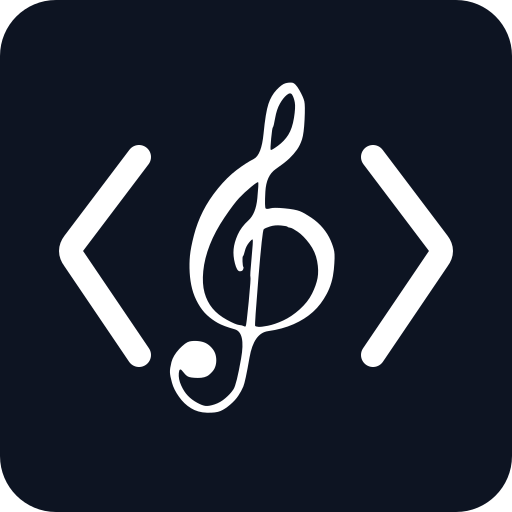

<div align="center">
  
  <h1>Code Composer</h1>
  <p>
    
    <a href="https://github.com/ictseoyoungmin/code-composer/actions/workflows/ci.yml"></a>
    
    
    <a href="LICENSE"></a>
  </p>
</div>

**Deterministic, model-free music composition and rendering for AI agents and programmable workflows.**

Code Composer turns explicit musical intent into editable structured music, deterministic audio, MIDI, exchange packages, and production handoff files. The **agent or user decides the music**; the engine validates and realizes those decisions reproducibly.

It is designed for workflows where the composition should remain inspectable, revisable, and portable instead of disappearing inside a black-box generation step.

> **Pre-release rebuild (2026-09-23):** the composer-facing authoring architecture is undergoing a breaking Composer-first rebuild. The current explicit CompositionBrief / seed-first / fixed-role path remains a pre-refactor reference, not a compatibility promise. Validated instrument engines, rendering, export, determinism, provenance, and v1.16.x-level contract rigor are being retained. See [CR00](docs/architecture/CR00_COMPOSER_REBUILD_BOUNDARY.md).

## What you can do

| Capability | What it gives you |
|---|---|
| Compose | Compile an explicit composition brief into canonical Music IR |
| Render | Deterministically render Music IR to WAV |
| Export MIDI | Create deterministic SMF Type 1 MIDI for DAWs and collaborators |
| Use modeled instruments | Piano, bowed-string/violin, plucked bass, percussion, and generic instrument engines |
| Shape performance | Violin realization, articulation, dynamics, factory sound presets, mix automation |
| Revise with matched A/B | Composer-authored targeted Performance Score revision with exact before/after provenance |
| Exchange projects | Lossless `.ccx` handoff between Code Composer users |
| Deliver externally | Reference mix, full/per-track MIDI, aligned stems, resolved IR, manifest, notes |
| Work as an agent skill | Self-contained `skills/code-composer/` package with progressive-disclosure workflows |

Code Composer does **not** use a bundled model to decide melody, harmony, rhythm, form, or style. Musical decisions come from the current user brief, current composition, and the agent/user workflow.

## Install

### Agent skill / plugin discovery

With the Skills CLI:

```bash
npx skills add ictseoyoungmin/code-composer --skill code-composer --agent claude-code
npx skills add ictseoyoungmin/code-composer --skill code-composer --agent codex
```

Use the matching `--agent` value for another supported agent.

Code Composer uses thin discovery adapters:

- `.claude-plugin/` — Claude discovery / marketplace metadata
- `.codex-plugin/` — Codex plugin metadata and product interface
- `.agents/plugins/` — generic agent marketplace metadata
- `skills/code-composer/` — the **only canonical skill source**

Every adapter routes to the same `./skills/` tree. There is no platform-specific copy of the instructions or engine in source control.

### Python engine

Requirements: **Python 3.10+**.

```bash
git clone https://github.com/ictseoyoungmin/code-composer.git
cd code-composer
python -m pip install ./skills/code-composer/kit
```

Check the available commands and factory presets:

```bash
code-composer --help
code-composer-presets list
```

## Quick start

### Render a minimal deterministic fixture

The repository includes a tiny synthetic protocol fixture for smoke testing:

```bash
code-composer \
  skills/code-composer/kit/fixtures/synthetic-minimal-ir.json \
  demo.wav
```

This fixture is intentionally minimal and is **not** a musical style reference.

### Use the canonical agent skill

The skill entry point is [`skills/code-composer/SKILL.md`](skills/code-composer/SKILL.md). It routes an agent into only the workflow and contracts required for the current task instead of requiring broad source-code inspection.

OpenAI product metadata lives with the skill at [`skills/code-composer/agents/openai.yaml`](skills/code-composer/agents/openai.yaml), and the canonical icon is [`skills/code-composer/assets/icon.svg`](skills/code-composer/assets/icon.svg).

To build standalone skill and platform plugin artifacts:

```bash
python tools/verify_plugin_distribution.py
python tools/build_skill.py
python tools/build_plugins.py
```

## Core workflow

```text
user brief / current song
        ↓
agent musical decisions
        ↓
canonical Music IR
        ↓
deterministic validation + realization
        ↓
render / MIDI / .ccx / delivery package
        ↓
analysis evidence
        ↓
explicit revision
```

Analyzers provide evidence; they do not silently rewrite the composition. The editable authority remains the canonical Music IR.

## Public commands

```text
code-composer                 render Music IR
code-composer-song            validate/lower/render/revise/compare Composer-first Song + Performance Score
code-composer-compose         pre-refactor brief → Music IR path
code-composer-midi            export MIDI
code-composer-collab          create a collaboration bundle
code-composer-exchange        export/import/inspect .ccx projects
code-composer-delivery        create external production handoff files
code-composer-presets         inspect/materialize factory presets
code-composer-violin          realize violin performance mechanics
code-composer-admittance-fit  fit measured bridge-admittance responses
```

See [`skills/code-composer/kit/COMMANDS.md`](skills/code-composer/kit/COMMANDS.md) for command syntax and [`skills/code-composer/kit/CAPABILITIES.md`](skills/code-composer/kit/CAPABILITIES.md) for the full capability surface.

## Instruments and sound

Current built-in engine families include:

- piano;
- bowed string and physically-inspired bowed waveguide / violin;
- plucked electric bass;
- acoustic-kit percussion;
- generic graph-based instruments.

Factory presets are **sonic resources only**. They do not contain melodies, rhythms, progressions, arrangements, or completed songs.

## Reproducibility

Code Composer is designed for deterministic re-rendering from the same authored state and seed. Historical byte-exact DSP regression tests run on a pinned numerical CI stack; see [`docs/NUMERICAL_REPRODUCIBILITY.md`](docs/NUMERICAL_REPRODUCIBILITY.md).

The current `main` branch is the stable source baseline. Active engine work is developed on feature branches and validated before it lands.

## Documentation

- [Documentation index](docs/INDEX.md)
- [Public commands](skills/code-composer/kit/COMMANDS.md)
- [Capabilities](skills/code-composer/kit/CAPABILITIES.md)
- [Build and packaging](docs/BUILD.md)
- [Repository structure](docs/STRUCTURE.md)
- [Changelog](CHANGELOG.md)
- [Research and attribution notes](CREDITS.md)

Historical slice reports, release manifests, checksums, maintenance evidence, and old design status files are retained under `docs/history/`, `docs/validation/`, and `docs/maintenance/`. They are **not** the user entry point.

## Development

```bash
PYTHONPATH=skills/code-composer/kit/src pytest -q
python skills/code-composer/kit/scripts/self_check.py
python tools/validate_skill.py
python tools/verify_plugin_distribution.py
```

CI runs blocking regression and release builds on Python 3.10 and 3.12. Three historical drum byte-hash tests known to vary across hosted runners remain visible non-blocking probes under Issue #2; their golden hashes are not silently rebased.

## License and generated music

Code Composer software is licensed under **GNU AGPL v3.0 only (`AGPL-3.0-only`)**. See [`LICENSE`](LICENSE).

The project separates the software license from ordinary musical output policy:

- [`COPYRIGHT_POLICY.md`](COPYRIGHT_POLICY.md) — responsibility for lawful inputs, references, and use of third-party material;
- [`OUTPUT_POLICY.md`](OUTPUT_POLICY.md) — explains the project's position that ordinary music/audio/MIDI/score output is not intended to become AGPL-licensed merely because Code Composer generated or rendered it.

These policy documents do not modify the AGPL. Users remain responsible for determining whether third-party rights apply to material they provide or publish.